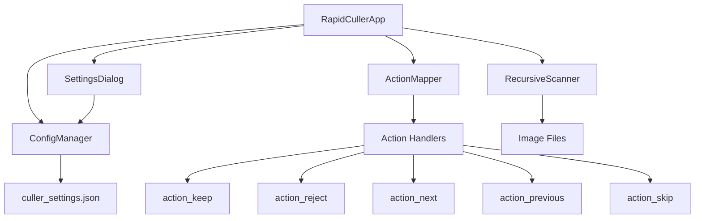
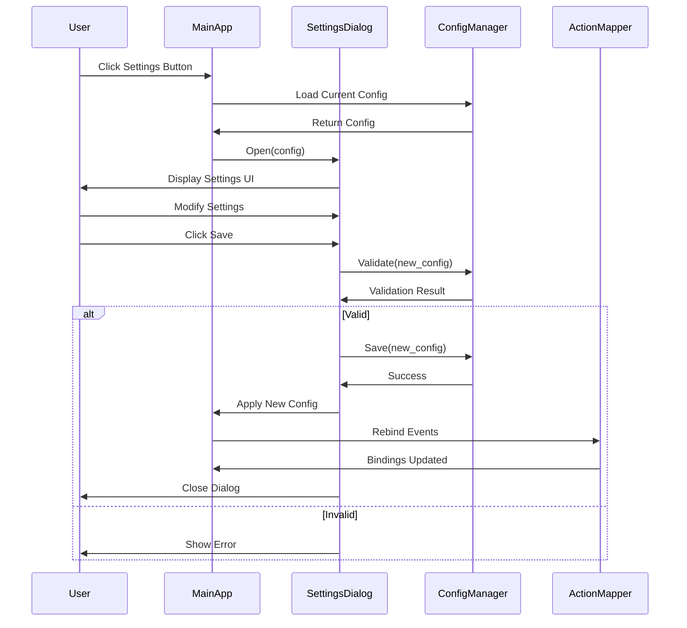

# Settings UI - Design Document

## Overview

This design extends the Rapid Image Culler application with a comprehensive settings system that allows users to configure button mappings, mouse wheel actions, and folder loading options. The design leverages the existing Tkinter GUI framework and settings persistence architecture while introducing new components for configuration management and dynamic event binding.

**Key Design Goals:**
- Maintain backward compatibility with existing `culler_settings.json` format
- Provide intuitive UI for configuration without technical knowledge
- Enable runtime reconfiguration of controls without restart
- Support recursive folder loading with subdirectory structure preservation
- Validate settings to prevent invalid configurations

---

## Code Reuse Analysis

### Existing Components to Leverage

**1. Settings Persistence (app.py:72-105)**
- `load_settings()` - Extend to load new config fields (button mappings, wheel actions, recursive flag)
- `save_settings()` - Extend to persist expanded configuration schema
- JSON file handling pattern - Reuse error handling and validation approach
- Directory existence validation - Apply to new config fields

**2. Event Binding System (app.py:64-66)**
- `image_label.bind()` pattern - Extend to add wheel events (`<MouseWheel>`, `<Button-4>`, `<Button-5>`)
- Event handler signature - Follow existing `action_keep(event)` pattern for new actions
- Event-to-action mapping - Create configurable routing system

**3. File Scanning Logic (app.py:129-155)**
- `load_images_start()` - Enhance to support recursive scanning
- `valid_extensions` list - Reuse for recursive scanning
- File sorting pattern - Maintain for consistent ordering
- Error handling - Apply to subdirectory access errors

**4. GUI Layout Patterns**
- Frame-based layout (app.py:28-62) - Follow for settings dialog
- Button styling (app.py:32, 44) - Maintain consistent look
- Label-value pairs (app.py:34-35) - Use for settings display
- Grid layout (app.py:33-45) - Apply to settings form

**5. File Operations**
- `move_and_advance()` (app.py:187-211) - Extend to handle subdirectory structures
- Filename uniqueness handling (app.py:194-199) - Reuse for recursive moves
- Error handling pattern (app.py:204-206) - Apply to new operations

### New Components to Build

**1. SettingsDialog Class**
- Modal Tkinter Toplevel window
- Tab/section organization for control mappings and options
- Validation logic for configuration
- Save/Cancel/Reset buttons

**2. ActionMapper Class**
- Dynamic event-to-action routing
- Configuration-based binding system
- Action execution logic (keep, reject, next, previous, skip)

**3. RecursiveScanner Module**
- os.walk-based directory traversal
- Relative path tracking for structure preservation
- Symlink detection and handling

**4. ConfigValidator Class**
- Schema validation for settings
- Migration logic for old configs
- Default value generation

---

## Architecture

### System Architecture



### Component Interaction Flow



---

## Components and Interfaces

### 1. ConfigManager Class

**Purpose:** Centralized configuration management with validation and persistence.

**Location:** New class in `app.py` or separate `config_manager.py`

**Responsibilities:**
- Load/save configuration from JSON
- Validate configuration schema
- Provide default values
- Migrate old config formats
- Handle config corruption

**Interface:**
```python
class ConfigManager:
    DEFAULT_CONFIG = {
        "src": "",
        "keep": "",
        "button_mappings": {
            "left_click": "keep",
            "right_click": "reject"
        },
        "wheel_mappings": {
            "wheel_up": "previous",
            "wheel_down": "next"
        },
        "options": {
            "recursive_loading": False
        }
    }

    def __init__(self, config_file="culler_settings.json"):
        self.config_file = config_file
        self.config = self.load()

    def load(self) -> dict:
        """Load config from file, migrate if needed, return defaults if missing."""
        pass

    def save(self, config: dict) -> bool:
        """Validate and save config to file."""
        pass

    def validate(self, config: dict) -> tuple[bool, str]:
        """Validate config structure, return (is_valid, error_message)."""
        pass

    def migrate(self, old_config: dict) -> dict:
        """Migrate old config format to new schema."""
        pass

    def get(self, key_path: str, default=None):
        """Get config value by dot notation (e.g., 'button_mappings.left_click')."""
        pass

    def set(self, key_path: str, value):
        """Set config value by dot notation."""
        pass
```

**_Leverage:_** Existing `load_settings()`, `save_settings()` patterns from app.py:72-105

---

### 2. ActionMapper Class

**Purpose:** Dynamic event binding and action routing based on configuration.

**Location:** New class in `app.py` or separate `action_mapper.py`

**Responsibilities:**
- Bind/unbind events based on configuration
- Route events to appropriate action handlers
- Maintain action-to-method mapping
- Handle disabled actions

**Interface:**
```python
class ActionMapper:
    ACTIONS = {
        "keep": "action_keep",
        "reject": "action_reject",
        "next": "action_next",
        "previous": "action_previous",
        "skip": "action_skip",
        "disabled": None
    }

    def __init__(self, app_instance):
        self.app = app_instance
        self.current_bindings = {}

    def bind_all(self, config: dict):
        """Bind all events based on config."""
        self.unbind_all()
        self._bind_buttons(config["button_mappings"])
        self._bind_wheel(config["wheel_mappings"])

    def unbind_all(self):
        """Remove all current bindings."""
        pass

    def _bind_buttons(self, button_config: dict):
        """Bind mouse button events."""
        pass

    def _bind_wheel(self, wheel_config: dict):
        """Bind mouse wheel events."""
        pass

    def _create_handler(self, action_name: str):
        """Create event handler that calls appropriate action method."""
        pass
```

**_Leverage:_** Existing `image_label.bind()` pattern from app.py:65-66

---

### 3. SettingsDialog Class

**Purpose:** Modal dialog for configuration UI.

**Location:** New class in `app.py` or separate `settings_dialog.py`

**Responsibilities:**
- Display current configuration
- Capture user modifications
- Validate before saving
- Provide reset to defaults

**Interface:**
```python
class SettingsDialog:
    def __init__(self, parent, config_manager: ConfigManager):
        self.parent = parent
        self.config_manager = config_manager
        self.dialog = None
        self.temp_config = {}

    def show(self):
        """Display modal settings dialog."""
        self.dialog = tk.Toplevel(self.parent)
        self.dialog.title("Settings")
        self.dialog.geometry("500x400")
        self.dialog.transient(self.parent)
        self.dialog.grab_set()

        self._load_current_config()
        self._build_ui()

    def _build_ui(self):
        """Construct settings UI with sections."""
        pass

    def _build_button_mappings_section(self, parent):
        """Build button mapping controls."""
        pass

    def _build_wheel_mappings_section(self, parent):
        """Build wheel mapping controls."""
        pass

    def _build_options_section(self, parent):
        """Build options (recursive loading, etc.)."""
        pass

    def _validate_and_save(self):
        """Validate temp_config and save if valid."""
        pass

    def _reset_to_defaults(self):
        """Reset all settings to default values."""
        pass

    def _cancel(self):
        """Close dialog without saving."""
        pass
```

**_Leverage:_** Tkinter Frame/Grid layout patterns from app.py:28-62

---

### 4. RecursiveScanner Module

**Purpose:** Scan directory tree for images, maintaining structure information.

**Location:** New module in `app.py` or separate `recursive_scanner.py`

**Responsibilities:**
- Traverse directory tree
- Filter by valid extensions
- Track relative paths
- Skip symlinks
- Handle permission errors

**Interface:**
```python
class RecursiveScanner:
    VALID_EXTENSIONS = ('.png', '.jpg', '.jpeg', '.bmp', '.webp')

    @staticmethod
    def scan(root_dir: str, recursive: bool = False) -> list[dict]:
        """
        Scan directory for images.

        Returns list of dicts with structure:
        {
            "filename": "image.png",
            "relative_path": "subdir/image.png",  # Empty string for root files
            "full_path": "/path/to/root/subdir/image.png"
        }
        """
        pass

    @staticmethod
    def _scan_recursive(root_dir: str) -> list[dict]:
        """Use os.walk to scan recursively."""
        pass

    @staticmethod
    def _scan_flat(root_dir: str) -> list[dict]:
        """Scan only root directory (current behavior)."""
        pass

    @staticmethod
    def _is_valid_image(filename: str) -> bool:
        """Check if filename has valid image extension."""
        pass
```

**_Leverage:_** Existing file scanning logic from app.py:136-146

---

### 5. Enhanced Action Handlers

**Purpose:** Extend existing action handlers and add new navigation actions.

**Location:** Methods in `RapidCullerApp` class

**New Methods:**
```python
class RapidCullerApp:
    # Existing: action_keep, action_reject

    def action_next(self, event):
        """Navigate to next image without moving current."""
        if self.current_index < len(self.image_files) - 1:
            self.current_index += 1
            self.show_current_image()

    def action_previous(self, event):
        """Navigate to previous image."""
        if self.current_index > 0:
            self.current_index -= 1
            self.show_current_image()

    def action_skip(self, event):
        """Mark as skipped and advance (future: track skipped items)."""
        # For now, just advance without moving file
        self.action_next(event)

    def move_and_advance_recursive(self, destination, image_info):
        """Enhanced move that preserves subdirectory structure."""
        # Create subdirectory in destination if needed
        # Move file maintaining relative path
        pass
```

**_Leverage:_** Existing `action_keep()`, `action_reject()`, `move_and_advance()` patterns from app.py:213-221

---

## Data Models

### Configuration Schema (JSON)

```json
{
  "src": "/path/to/source",
  "keep": "/path/to/keep",
  "button_mappings": {
    "left_click": "keep",
    "right_click": "reject"
  },
  "wheel_mappings": {
    "wheel_up": "previous",
    "wheel_down": "next"
  },
  "options": {
    "recursive_loading": false
  }
}
```

**Schema Evolution:**
- **v1 (current):** `{"src": "...", "keep": "..."}`
- **v2 (new):** Full schema above with backward compatibility

**Migration Strategy:**
```python
def migrate(old_config):
    if "button_mappings" not in old_config:
        # v1 to v2 migration
        new_config = ConfigManager.DEFAULT_CONFIG.copy()
        new_config["src"] = old_config.get("src", "")
        new_config["keep"] = old_config.get("keep", "")
        return new_config
    return old_config
```

---

### Image File Information Model

```python
ImageInfo = {
    "filename": str,        # e.g., "image.png"
    "relative_path": str,   # e.g., "subdir1/subdir2" or "" for root
    "full_path": str        # e.g., "/src/subdir1/subdir2/image.png"
}
```

**Usage:**
- Replace `self.image_files` list from `[filenames]` to `[ImageInfo dicts]`
- Update `show_current_image()` to use `image_info["full_path"]`
- Update `move_and_advance()` to preserve `relative_path` structure

---

## UI Design

### Settings Dialog Layout

```
┌─────────────────────────────────────────────────────┐
│  Settings                                      [X]  │
├─────────────────────────────────────────────────────┤
│                                                     │
│  ┌─ Button Mappings ──────────────────────────┐   │
│  │                                             │   │
│  │  Left Click:    [Dropdown: Keep ▼]         │   │
│  │  Right Click:   [Dropdown: Reject ▼]       │   │
│  │                                             │   │
│  └─────────────────────────────────────────────┘   │
│                                                     │
│  ┌─ Mouse Wheel Mappings ─────────────────────┐   │
│  │                                             │   │
│  │  Wheel Up:      [Dropdown: Previous ▼]     │   │
│  │  Wheel Down:    [Dropdown: Next ▼]         │   │
│  │                                             │   │
│  └─────────────────────────────────────────────┘   │
│                                                     │
│  ┌─ Loading Options ──────────────────────────┐   │
│  │                                             │   │
│  │  [✓] Load images from subdirectories       │   │
│  │      recursively                            │   │
│  │                                             │   │
│  └─────────────────────────────────────────────┘   │
│                                                     │
│                                                     │
│         [Reset Defaults]  [Cancel]  [Save]         │
└─────────────────────────────────────────────────────┘
```

**Action Dropdown Options:**
- Keep
- Reject
- Next
- Previous
- Skip
- Disabled

---

### Main Window Integration

Add settings button to control panel:

```python
# Add to control_frame after btn_load (app.py:45)
btn_settings = tk.Button(
    control_frame,
    text="⚙ Settings",
    bg="#6c757d",
    fg="white",
    command=self.open_settings
)
btn_settings.grid(row=2, column=2, sticky="e", padx=5, pady=(10,5))
```

---

## Error Handling

### 1. Configuration Errors

**Scenario:** Corrupted or invalid JSON in `culler_settings.json`

**Handling:**
```python
def load(self):
    try:
        with open(self.config_file, 'r') as f:
            config = json.load(f)
            if self.validate(config)[0]:
                return self.migrate(config)
            else:
                raise ValueError("Invalid config schema")
    except (FileNotFoundError, json.JSONDecodeError, ValueError) as e:
        print(f"Config error: {e}. Using defaults.")
        messagebox.showwarning(
            "Settings Error",
            "Could not load settings. Using defaults."
        )
        return self.DEFAULT_CONFIG.copy()
```

**_Leverage:_** Existing error handling pattern from app.py:92-93

---

### 2. Recursive Scanning Errors

**Scenario:** Permission denied on subdirectory during recursive scan

**Handling:**
```python
def _scan_recursive(root_dir):
    results = []
    for dirpath, dirnames, filenames in os.walk(root_dir):
        # Skip symlinks to prevent infinite loops
        dirnames[:] = [d for d in dirnames if not os.path.islink(os.path.join(dirpath, d))]

        try:
            for filename in filenames:
                if RecursiveScanner._is_valid_image(filename):
                    full_path = os.path.join(dirpath, filename)
                    rel_path = os.path.relpath(dirpath, root_dir)
                    if rel_path == ".":
                        rel_path = ""

                    results.append({
                        "filename": filename,
                        "relative_path": rel_path,
                        "full_path": full_path
                    })
        except PermissionError as e:
            print(f"Permission denied: {dirpath}")
            continue  # Skip this directory

    return results
```

---

### 3. File Move Errors with Subdirectories

**Scenario:** Cannot create subdirectory structure in destination

**Handling:**
```python
def move_and_advance_recursive(self, destination, image_info):
    try:
        # Create subdirectory if needed
        if image_info["relative_path"]:
            dest_subdir = os.path.join(destination, image_info["relative_path"])
            os.makedirs(dest_subdir, exist_ok=True)
            final_dest = dest_subdir
        else:
            final_dest = destination

        # Use existing move logic with uniqueness check
        dst_path = os.path.join(final_dest, image_info["filename"])
        base, ext = os.path.splitext(image_info["filename"])
        counter = 1
        while os.path.exists(dst_path):
            dst_path = os.path.join(final_dest, f"{base}_{counter}{ext}")
            counter += 1

        shutil.move(image_info["full_path"], dst_path)
        self.current_index += 1
        self.root.after(10, self.show_current_image)

    except (OSError, PermissionError) as e:
        messagebox.showerror("File Error", f"Could not move file:\n{e}")
```

**_Leverage:_** Existing `move_and_advance()` error handling from app.py:204-206

---

### 4. Settings Validation Errors

**Scenario:** User tries to save invalid configuration

**Handling:**
```python
def _validate_and_save(self):
    is_valid, error_msg = self.config_manager.validate(self.temp_config)

    if not is_valid:
        messagebox.showerror("Invalid Settings", error_msg)
        return

    # Check for warnings (non-blocking)
    warnings = self._check_warnings(self.temp_config)
    if warnings:
        proceed = messagebox.askyesno(
            "Configuration Warning",
            f"{warnings}\n\nProceed anyway?"
        )
        if not proceed:
            return

    self.config_manager.save(self.temp_config)
    self.dialog.destroy()
    self.parent.apply_config(self.temp_config)

def _check_warnings(self, config):
    """Return warning messages for potentially problematic configs."""
    warnings = []

    # Check if no buttons are mapped to keep/reject
    actions = list(config["button_mappings"].values())
    if "keep" not in actions and "reject" not in actions:
        warnings.append("⚠ No buttons mapped to Keep or Reject actions.")

    return "\n".join(warnings) if warnings else None
```

---

## Testing Strategy

### Unit Tests

**ConfigManager Tests:**
```python
def test_load_defaults_when_missing():
    # Test that DEFAULT_CONFIG is returned when file doesn't exist
    pass

def test_migrate_v1_to_v2():
    # Test migration from old {"src": "...", "keep": "..."} format
    pass

def test_validate_rejects_invalid_action():
    # Test that validation fails for unknown action names
    pass

def test_save_creates_valid_json():
    # Test that saved file is valid JSON
    pass
```

**ActionMapper Tests:**
```python
def test_bind_buttons_creates_bindings():
    # Test that button events are bound correctly
    pass

def test_unbind_removes_all_bindings():
    # Test that unbind_all cleans up properly
    pass

def test_action_routing():
    # Test that events route to correct action methods
    pass
```

**RecursiveScanner Tests:**
```python
def test_scan_flat_returns_root_only():
    # Test non-recursive scan
    pass

def test_scan_recursive_includes_subdirs():
    # Test recursive scan includes all subdirectories
    pass

def test_skip_symlinks():
    # Test that symbolic links are skipped
    pass

def test_relative_path_tracking():
    # Test that relative_path is correctly calculated
    pass
```

---

### Integration Tests

**Settings Dialog Integration:**
```python
def test_open_settings_displays_dialog():
    # Test that settings button opens dialog
    pass

def test_save_applies_new_mappings():
    # Test that saving settings updates event bindings
    pass

def test_cancel_discards_changes():
    # Test that cancel leaves config unchanged
    pass
```

**Recursive Loading Integration:**
```python
def test_recursive_load_preserves_structure():
    # Create test directory tree
    # Load recursively
    # Move files
    # Verify subdirectory structure in destination
    pass

def test_move_creates_subdirs_in_destination():
    # Test that subdirectories are created as needed
    pass
```

**Event Binding Integration:**
```python
def test_configured_button_executes_action():
    # Configure left click to "next"
    # Simulate left click
    # Verify next image is shown without file move
    pass

def test_wheel_events_navigate():
    # Configure wheel up/down
    # Simulate wheel events
    # Verify navigation occurs
    pass
```

---

### Manual Testing Checklist

**Settings UI:**
- [ ] Settings dialog opens and closes properly
- [ ] All dropdowns display correct action options
- [ ] Save button validates and persists changes
- [ ] Cancel button discards changes
- [ ] Reset button restores defaults
- [ ] Dialog is modal (blocks main window interaction)

**Button Mappings:**
- [ ] Left click executes configured action
- [ ] Right click executes configured action
- [ ] Changing mappings in settings updates behavior
- [ ] All action types work correctly (keep, reject, next, previous, skip)

**Mouse Wheel:**
- [ ] Wheel up executes configured action
- [ ] Wheel down executes configured action
- [ ] Wheel events work on Windows, macOS, Linux
- [ ] Disabling wheel actions prevents wheel events

**Recursive Loading:**
- [ ] Recursive flag loads subdirectories
- [ ] Non-recursive flag only loads root (existing behavior)
- [ ] File moves preserve subdirectory structure
- [ ] Status label shows correct total count
- [ ] Permission errors don't crash app
- [ ] Symlinks are skipped

**Persistence:**
- [ ] Settings persist across app restarts
- [ ] Old config files are migrated successfully
- [ ] Corrupted config falls back to defaults gracefully

---

## Implementation Notes

### Phase 1: Core Infrastructure
1. Implement `ConfigManager` class with schema and migration
2. Extend `save_settings()` and `load_settings()` to use `ConfigManager`
3. Update config schema in JSON file

### Phase 2: Action System
1. Implement `ActionMapper` class
2. Add new action methods (`action_next`, `action_previous`, `action_skip`)
3. Refactor existing event bindings to use `ActionMapper`

### Phase 3: Settings UI
1. Implement `SettingsDialog` class
2. Add settings button to main window
3. Wire up dialog save/cancel/reset logic

### Phase 4: Recursive Loading
1. Implement `RecursiveScanner` module
2. Update `load_images_start()` to use scanner with recursive flag
3. Enhance `move_and_advance()` to handle subdirectory structure
4. Update `image_files` from simple list to list of ImageInfo dicts

### Phase 5: Testing & Polish
1. Write unit tests for all new components
2. Manual testing on all platforms
3. Error handling edge cases
4. UI polish and tooltips

---

## Backward Compatibility

**Existing Config Migration:**
```python
# Old format
{"src": "/path/src", "keep": "/path/keep"}

# Migrated to
{
    "src": "/path/src",
    "keep": "/path/keep",
    "button_mappings": {"left_click": "keep", "right_click": "reject"},
    "wheel_mappings": {"wheel_up": "previous", "wheel_down": "next"},
    "options": {"recursive_loading": false}
}
```

**Behavior Preservation:**
- Default mappings match current behavior (left=keep, right=reject)
- Recursive loading defaults to `false` (current flat behavior)
- Existing code paths remain unchanged when using defaults

---

## Performance Considerations

1. **Recursive Scanning:** For large directory trees (>10,000 images), consider:
   - Background thread for scanning
   - Progress bar during load
   - Lazy loading of images

2. **Event Binding:** Unbinding/rebinding events is fast, no performance concerns

3. **Config I/O:** JSON read/write is fast for small configs, no caching needed

---

## Future Enhancements (Out of Scope)

1. Keyboard shortcut configuration
2. Custom action scripting
3. Undo/redo for file moves
4. Multiple destination folders
5. Tagging/metadata system
6. Image preview thumbnails in settings
7. Export/import settings profiles
8. Dark mode theme
